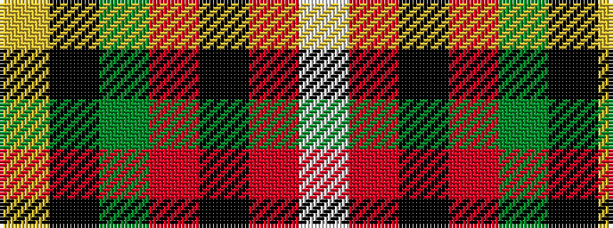

WRKRGKY

It is a 7 stripe tartan.

<figure class="pat-woven">

<figcaption>idealised sample</figcaption>
</figure>

## Colour Sequence



## Tartans with this colour sequence

| Tartans |
|---------------|
| [Thirkill (Dalgliesh)](/variants/s7/w6r18k2r6g7k8ly6~x4/)|
||
