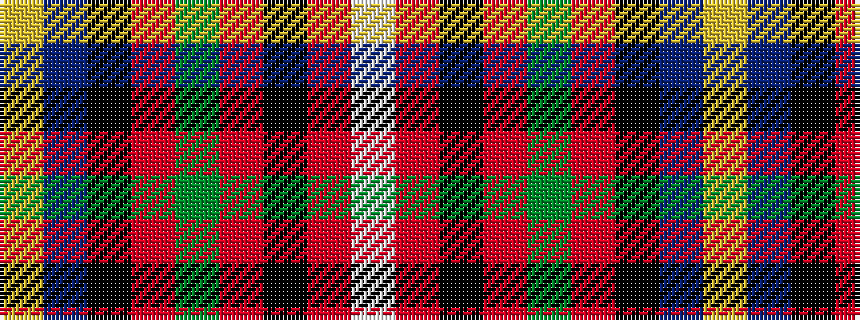

WRKRGRKBY

It is a 9 stripe tartan.

<figure class="pat-woven">

<figcaption>idealised sample</figcaption>
</figure>

## Colour Sequence



## Tartans with this colour sequence

| Tartans |
|---------------|
| [George Brown](/variants/s9/ly3db29k15r4g25r8k4r3w2~x2/)|
||
