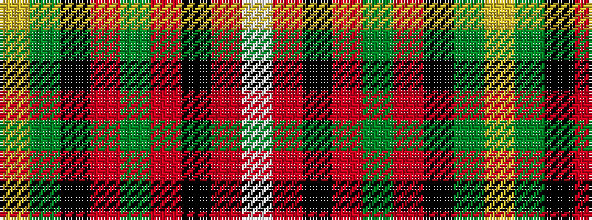

WRKRGRKGY

It is a 9 stripe tartan.

<figure class="pat-woven">

<figcaption>idealised sample</figcaption>
</figure>

## Colour Sequence



## Tartans with this colour sequence

| Tartans |
|---------------|
| [Brown, George](/setts/s9/w3r3k4r6g22r4k18g24ly3~x2/)|
||
