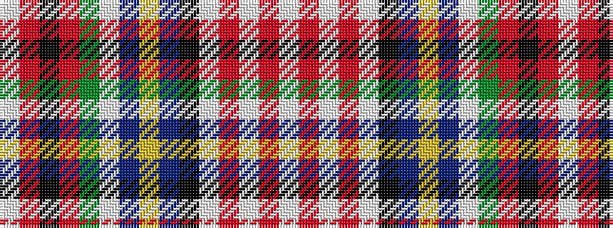

WRKRGWBYBKWRWRW

It is a 15 stripe tartan.

<figure class="pat-woven">

<figcaption>idealised sample</figcaption>
</figure>

## Colour Sequence



## Tartans with this colour sequence

| Tartans |
|---------------|
| [Stewart dress](/variants/s15/w20r4w4r7w132k26db26ly6db6w9g83r30k5r7w4/)|
||
