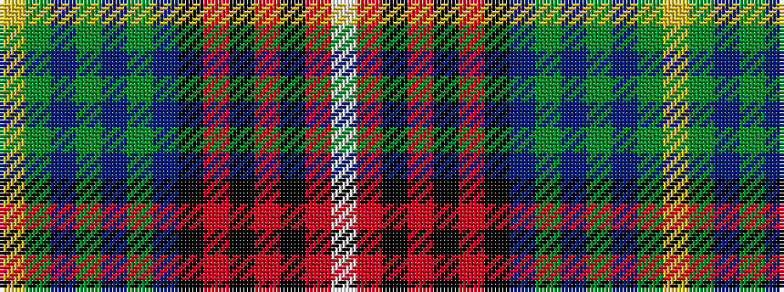

WRKRKRKBGBGBGY

It is a 14 stripe tartan.

<figure class="pat-woven">

<figcaption>idealised sample</figcaption>
</figure>

## Colour Sequence



## Tartans with this colour sequence

| Tartans |
|---------------|
| [Gotts (Personal)](/variants/s14/w2m19k2m2k3m2k8db8dg2db3dg2db2dg19lo2~x2/)|
||
