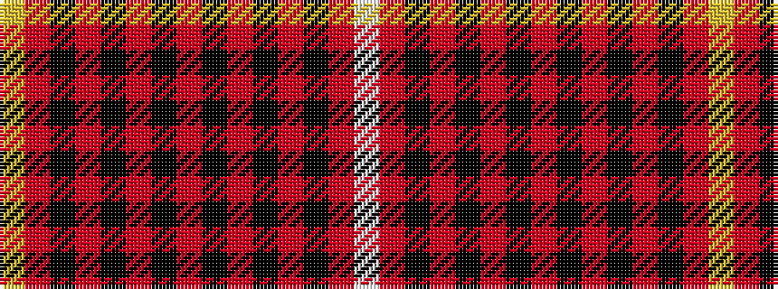

WRKRKRKRKRKRKRY

It is a 15 stripe tartan.

<figure class="pat-woven">

<figcaption>idealised sample</figcaption>
</figure>

## Colour Sequence



## Tartans with this colour sequence

| Tartans |
|---------------|
| [Killin (Name)](/setts/s15/w2r20k4r9k26r2k6r2k26r4k4r4k4r18lo2~x2/)|
||
