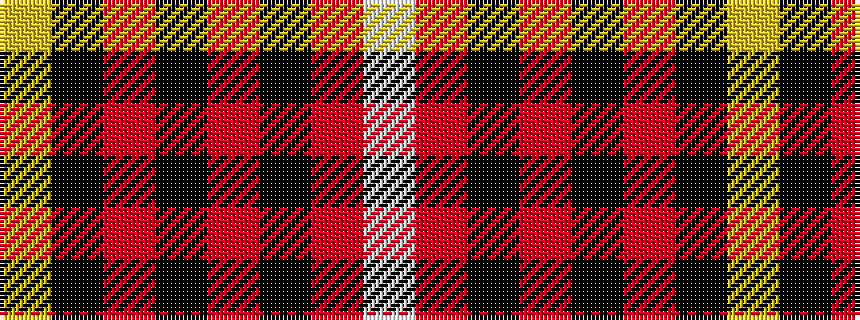

WRKRKRKY

It is a 8 stripe tartan.

<figure class="pat-woven">

<figcaption>idealised sample</figcaption>
</figure>

## Colour Sequence



## Tartans with this colour sequence

| Tartans |
|---------------|
| [Mens Bigi](/variants/s8/lo4k17r1k4r2k4r33w3~x2/)|
||
