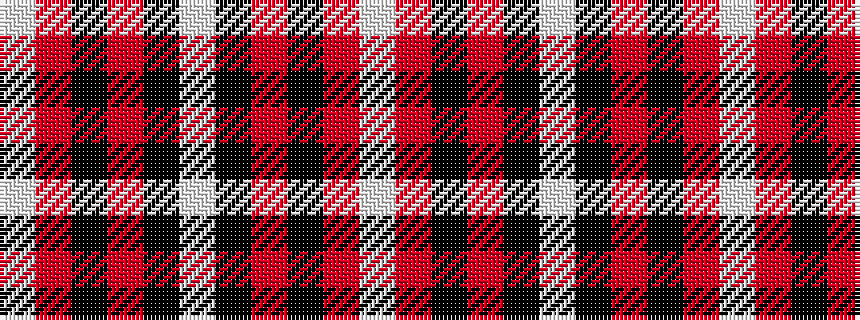

WRKRKWKRKRW

It is a 11 stripe tartan.

<figure class="pat-woven">

<figcaption>idealised sample</figcaption>
</figure>

## Colour Sequence



## Tartans with this colour sequence

| Tartans |
|---------------|
| [Stewart Grey Dress Tartan](/variants/s11/w30o5k6o2k2w2k13o5k2o2w2~x2/)|
||
