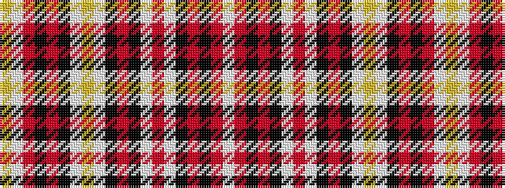

WRKRKWRWKRKWYWKRKRWY

It is a 20 stripe tartan.

<figure class="pat-woven">

<figcaption>idealised sample</figcaption>
</figure>

## Colour Sequence



## Tartans with this colour sequence

| Tartans |
|---------------|
| [Holy Sepulchre Corporate Tartan](/variants/s20/w2r13k17r2k17w2r13w2k17r2k17w2ly4w2k17r2k17r13w2ly2~x2/)|
||
| [Order of the Holy Sepulchre (Corp)](/variants/s20/w1r7k7r1k7w1r7w1k7r1k7w1lo2w1k8r1k8r7w1ly1~x4/)|
||
