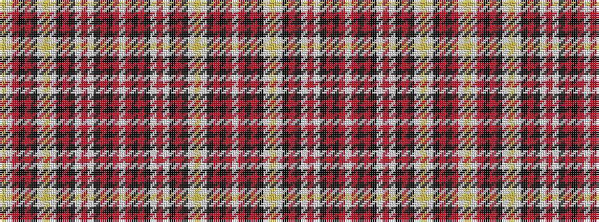

WRKRKWYWKRKWRWKRKRWRKRKWRWKRKWYWKRKRWY

It is a 38 stripe tartan.

<figure class="pat-woven">

<figcaption>idealised sample</figcaption>
</figure>

## Colour Sequence



## Tartans with this colour sequence

| Tartans |
|---------------|
| [Order of the Holy Sepulchre](/variants/s38/w1r7k7r1k7w1r7w1k7r1k7w1lo2w1k8r1k8r7w1ly1~x4/)|
||
