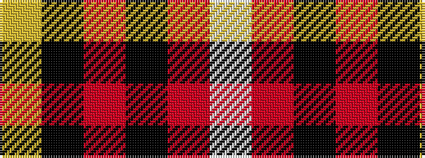

WRKRKY

It is a 6 stripe tartan.

<figure class="pat-woven">

<figcaption>idealised sample</figcaption>
</figure>

## Colour Sequence



## Tartans with this colour sequence

| Tartans |
|---------------|
| [Drambuie](/setts/s6/w6r36k48o4k5ly6/)|
||
| [Drambuie dress](/setts/s6/w6o36k48r4k5ly6/)|
||
