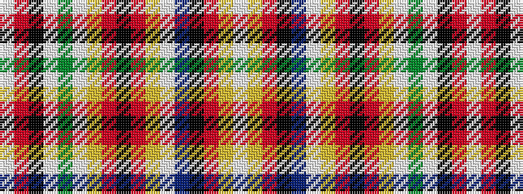

WRKWGWYRKRYWBKRYW

It is a 17 stripe tartan.

<figure class="pat-woven">

<figcaption>idealised sample</figcaption>
</figure>

## Colour Sequence



## Tartans with this colour sequence

| Tartans |
|---------------|
| [Chattan, Chief](/setts/s17/w4ly12r8k8t32w4ly7r7k2r7ly7w4g32w2k8r60w2/)|
||
| [Chattan, Chief of Clan](/tartans/w4ly12r8k8t32w4ly7r7k2r7ly7w4g32w2k4r60w2/)|
||
