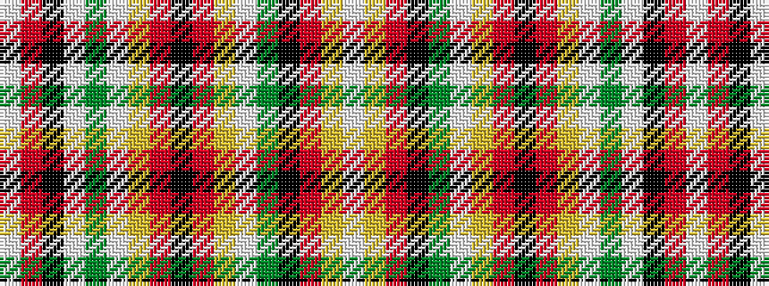

WRKWGWYRKRYWGKRYW

It is a 17 stripe tartan.

<figure class="pat-woven">

<figcaption>idealised sample</figcaption>
</figure>

## Colour Sequence



## Tartans with this colour sequence

| Tartans |
|---------------|
| [Chattan](/setts/s17/w4ly10r8k7y28w3ly6r5k2r5ly6w3g30w2k3r50w2~x2/)|
||
