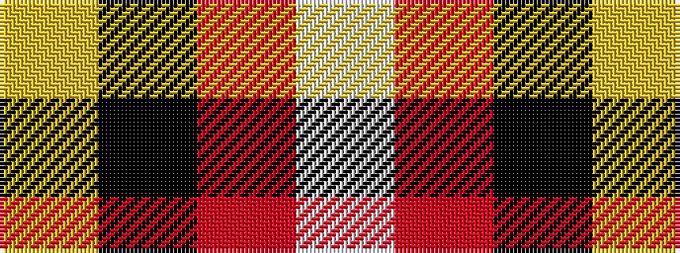

WRKY

It is a 4 stripe tartan.

<figure class="pat-woven">

<figcaption>idealised sample</figcaption>
</figure>

## Colour Sequence



## Tartans with this colour sequence

| Tartans |
|---------------|
| [Connel](/setts/w1r8k8ly1/)|
||
| [Masai Shuka 18 (Artefact)](/variants/s4/ly6k3r40w3~x2/)|
||
| [Riddick Furya](/variants/s4/ly2k3r31w1~x4/)|
||
