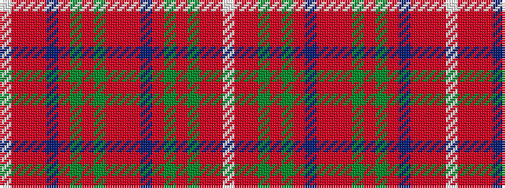

WRRGRGRBRRRGRGRBRRRW

It is a 20 stripe tartan.

<figure class="pat-woven">

<figcaption>idealised sample</figcaption>
</figure>

## Colour Sequence



## Tartans with this colour sequence

| Tartans |
|---------------|
| [MacDougall](/variants/s20/lb1ri3r1dg23r3dg1r3db6ri4r1ri4dg6r6dg6r2db1r24ri1r1lb1~x2/)|
||
