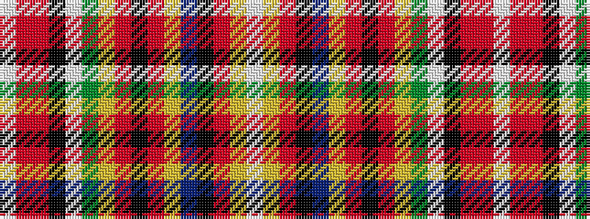

WRRKWGYRKRYBKRYW

It is a 16 stripe tartan.

<figure class="pat-woven">

<figcaption>idealised sample</figcaption>
</figure>

## Colour Sequence



## Tartans with this colour sequence

| Tartans |
|---------------|
| [Finzean's Fancy Artifact Tartan](/variants/s16/w5ly8r6k6t28ly12r6k2r6ly12g28w2k4r54m1w2~x2/)|
||
| [Finzean, Fancy](/variants/s16/w5ly8r6k6t28ly12r6k2r6ly12g28w2k4r54ri1w2~x2/)|
||
