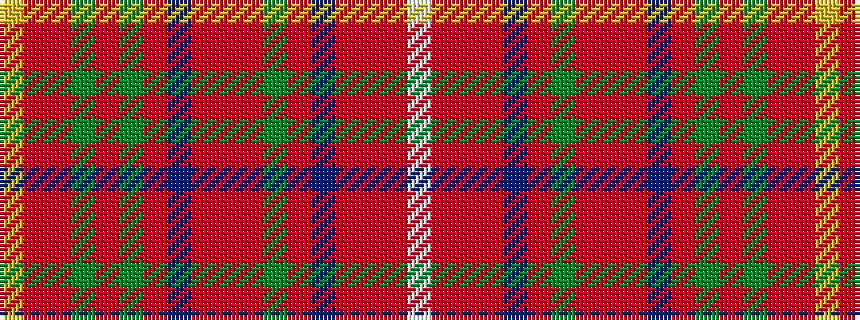

WRRRBRGRRRBRGRGRRY

It is a 18 stripe tartan.

<figure class="pat-woven">

<figcaption>idealised sample</figcaption>
</figure>

## Colour Sequence



## Tartans with this colour sequence

| Tartans |
|---------------|
| [Sommerville](/setts/s18/w2r3r6r48db4r2g16r5r3r5db20r5g3r5g54r3r5ly2~x2/)|
||
| [Sommerville](/setts/s18/w2r3r5r48db4r2g17r5r3r5db21r5g3r5g54r3r5ly2/)|
||
