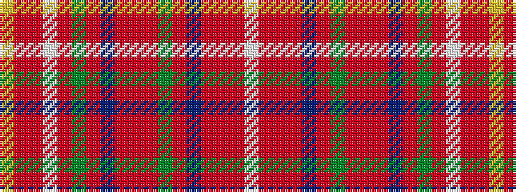

WRRRBRGRRRBRGRWRRY

It is a 18 stripe tartan.

<figure class="pat-woven">

<figcaption>idealised sample</figcaption>
</figure>

## Colour Sequence



## Tartans with this colour sequence

| Tartans |
|---------------|
| [Somerville Dress (Name?)](/setts/s18/w2r3ri6r48db4r2g16ri5r3ri5db20r5g3r5w54r3ri5ly2~x2/)|
||
