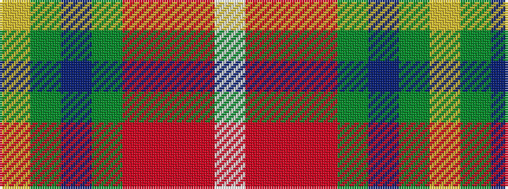

WRRRGBGY

It is a 8 stripe tartan.

<figure class="pat-woven">

<figcaption>idealised sample</figcaption>
</figure>

## Colour Sequence



## Tartans with this colour sequence

| Tartans |
|---------------|
| [Etienne, Paschal Tache Sir...](/setts/s8/w3o1r29o16g23db3g3ly2~x2/)|
||
