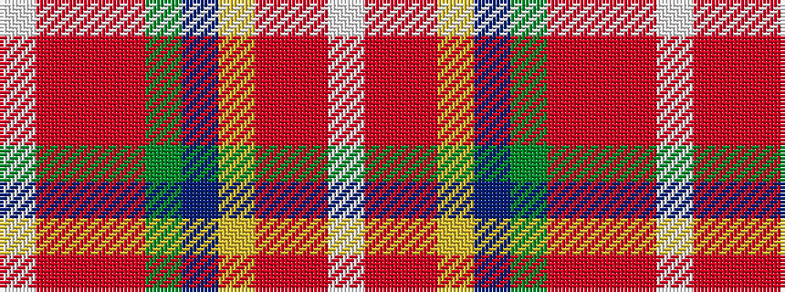

WRRRGBYRRW

It is a 10 stripe tartan.

<figure class="pat-woven">

<figcaption>idealised sample</figcaption>
</figure>

## Colour Sequence



## Tartans with this colour sequence

| Tartans |
|---------------|
| [Unidentified, Silk scarf](/setts/s10/w3r10o6ly8t8g32r8r10r6w3~x4/)|
||
