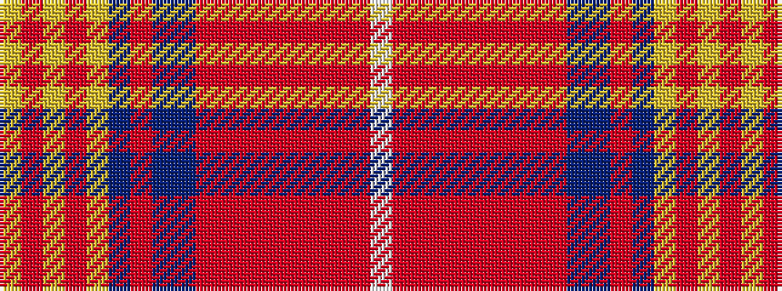

WRRRRRRRRBBRBYRYRY

It is a 18 stripe tartan.

<figure class="pat-woven">

<figcaption>idealised sample</figcaption>
</figure>

## Colour Sequence



## Tartans with this colour sequence

| Tartans |
|---------------|
| [Red Lichtie (District)](/variants/s18/w3r2ri1r9ri1r2ri2r1ri27db1t2ri1db11lo1ri2lo1ri2lo1~x2/)|
||
