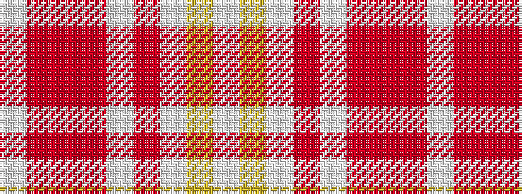

WRRRWRWYW

It is a 9 stripe tartan.

<figure class="pat-woven">

<figcaption>idealised sample</figcaption>
</figure>

## Colour Sequence



## Tartans with this colour sequence

| Tartans |
|---------------|
| [Yair Dance](/variants/s9/w3ly4w26m18w2m4r2m4w2~x2/)|
||
