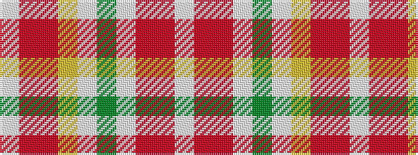

WRRWGWYRRW

It is a 10 stripe tartan.

<figure class="pat-woven">

<figcaption>idealised sample</figcaption>
</figure>

## Colour Sequence



## Tartans with this colour sequence

| Tartans |
|---------------|
| [Jacobite, Silk sash](/setts/s10/w2r8o5ly6w5g21w6r8r4w2/)|
||
