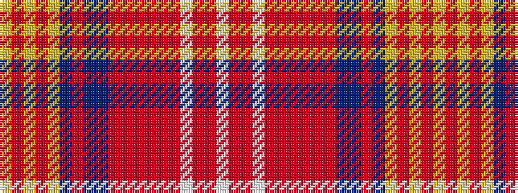

WRRWRRRRRRBBRBYRYRY

It is a 19 stripe tartan.

<figure class="pat-woven">

<figcaption>idealised sample</figcaption>
</figure>

## Colour Sequence



## Tartans with this colour sequence

| Tartans |
|---------------|
| [Red Lichtie](/setts/s19/w3r2r1w1r9r1r2r2r1r27dt1t2r1dt11lo1r2lo1r2lo1~x2/)|
||
