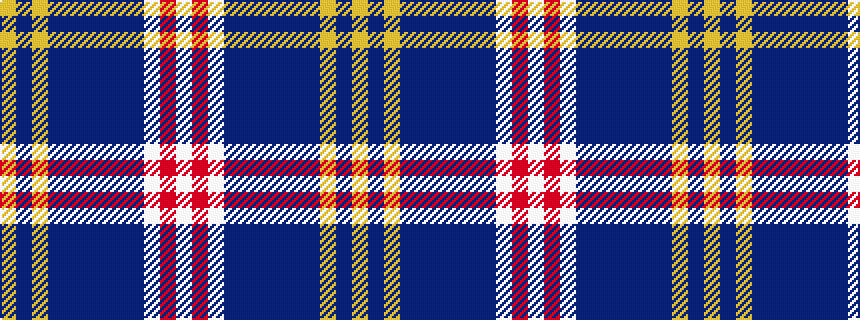

WRWBBBBBBYBY

It is a 12 stripe tartan.

<figure class="pat-woven">

<figcaption>idealised sample</figcaption>
</figure>

## Colour Sequence



## Tartans with this colour sequence

| Tartans |
|---------------|
| [Payeur, Francois (Personal)](/variants/s12/w6r2w24dt12db3dt2db2dt2db12lo1db1lo3~x2/)|
||
| [Payeur, François (Personal)](/variants/s12/w6r2w24db12dbi3db2dbi2db2dbi12ly1dbi1ly3~x2/)|
||
