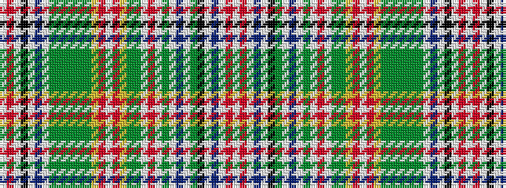

WRWBWKGWBWGWRWGGYRWRYGGGGGGWBWKWRW

It is a 34 stripe tartan.

<figure class="pat-woven">

<figcaption>idealised sample</figcaption>
</figure>

## Colour Sequence



## Tartans with this colour sequence

| Tartans |
|---------------|
| [Hunter](/setts/s34/w2r8w2k15w2t5w2g20g2g4g2g20g3ly3r2w2r2ly3g3g20w2r32w2g20w2t5w2g4k15w2t5w2r8w2/)|
||
