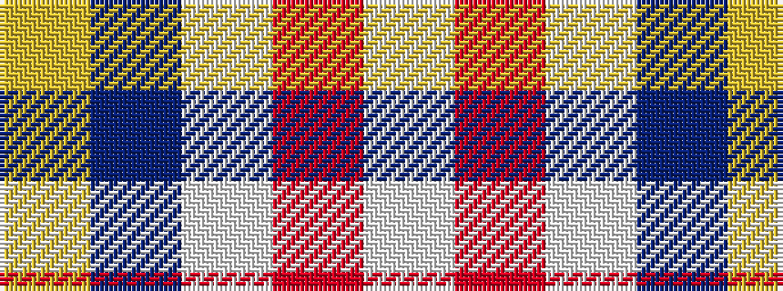

WRWBY

It is a 5 stripe tartan.

<figure class="pat-woven">

<figcaption>idealised sample</figcaption>
</figure>

## Colour Sequence



## Tartans with this colour sequence

| Tartans |
|---------------|
| [Common Ground (Dress)](/variants/s5/w3r27w16db27ly3~x2/)|
||
| [Common Ground Dress (Fashion)](/variants/s5/w3r27w16db27lo3~x2/)|
||
