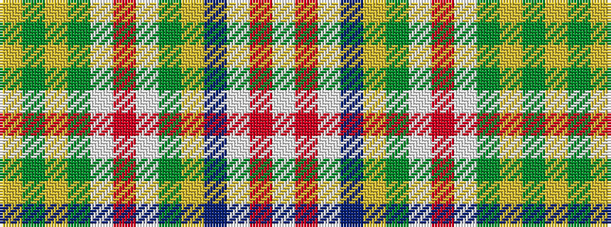

WRWBYGWRWGYGY

It is a 13 stripe tartan.

<figure class="pat-woven">

<figcaption>idealised sample</figcaption>
</figure>

## Colour Sequence



## Tartans with this colour sequence

| Tartans |
|---------------|
| [Okanagan(District)](/variants/s13/lb17r2w2db9ly2yi16w1r6w1g5ly1y8ly2~x2/)|
||
