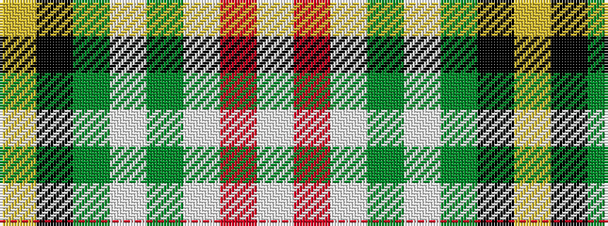

WRWGWGKY

It is a 8 stripe tartan.

<figure class="pat-woven">

<figcaption>idealised sample</figcaption>
</figure>

## Colour Sequence



## Tartans with this colour sequence

| Tartans |
|---------------|
| [L'Abeille du Cercle de Fermières Sainte-Geneviève-de-Sainte-Foy](/variants/s8/lt2r2lt30dg20lt3dg7k2ly1~x2/)|
||
