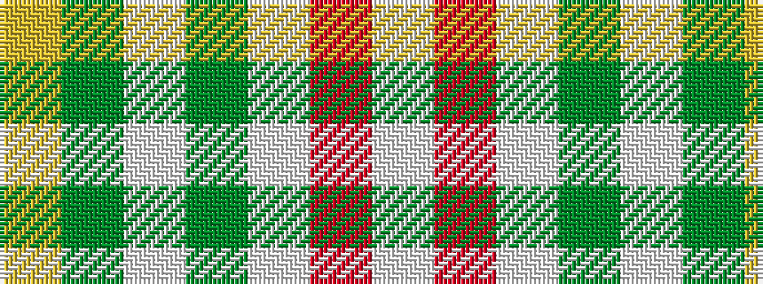

WRWGWGY

It is a 7 stripe tartan.

<figure class="pat-woven">

<figcaption>idealised sample</figcaption>
</figure>

## Colour Sequence



## Tartans with this colour sequence

| Tartans |
|---------------|
| [MacPherson Dress Blue (Dance) #2](/variants/s7/w5r3w26g21w3g8ly3~x2/)|
||
| [MacPherson Dress Green (Dance)](/variants/s7/w5r3w26g20w3g8ly3~x2/)|
||
