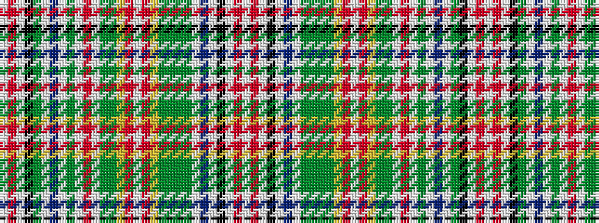

WRWKGWBWGWRWGGYRWRYGGGGWBWKWRW

It is a 30 stripe tartan.

<figure class="pat-woven">

<figcaption>idealised sample</figcaption>
</figure>

## Colour Sequence



## Tartans with this colour sequence

| Tartans |
|---------------|
| [Hunter (Wilsons)](/variants/s30/w2r8w2k15g4w2t5w2gi20w2r32w2gi20g3ly3r2w2r2ly3g3gi20g2gi20w2t5w2k15w2r8w2~x2/)|
||
