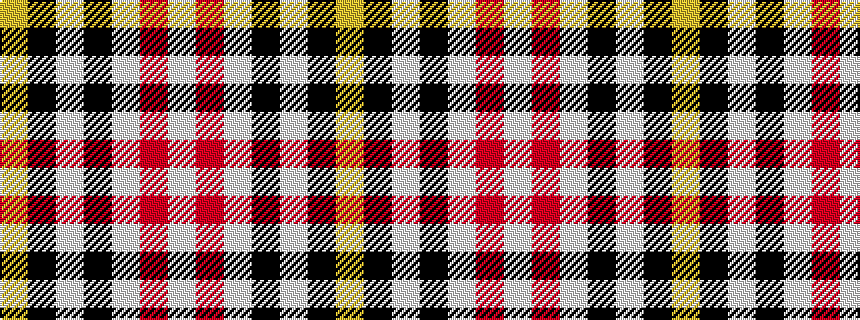

WRWKWKY

It is a 7 stripe tartan.

<figure class="pat-woven">

<figcaption>idealised sample</figcaption>
</figure>

## Colour Sequence



## Tartans with this colour sequence

| Tartans |
|---------------|
| [MacPherson - 1842 (VS) Dress](/variants/s7/w1m2w17k11w2k4ly1~x4/)|
||
| [MacPherson Dress](/variants/s7/lb3r1lb30k20lb3k9ly1/)|
||
| [MacPherson Dress (1842)](/variants/s7/w3r1w30k20w3k9ly1~x2/)|
||
| [MacPherson Dress, Blue (Dance)](/variants/s7/w5r3w26k21w3k8ly3~x2/)|
||
