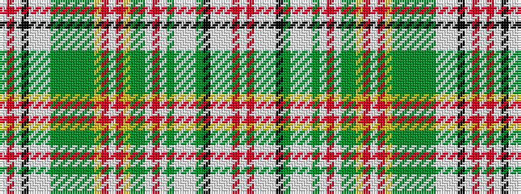

WRWKWWWGGGGGGYRWRYGGWRWGWWWGKWWWRW

It is a 34 stripe tartan.

<figure class="pat-woven">

<figcaption>idealised sample</figcaption>
</figure>

## Colour Sequence



## Tartans with this colour sequence

| Tartans |
|---------------|
| [Hunter (Wilsons1819)](/setts/s34/w2r8w2k15w2lb5w2dg20y2dg4y2dg20y3ly3r2w2r2ly3y3dg20w2r32w2dg20w2lb5w2y4k15w2lb5w2r8w2/)|
||
