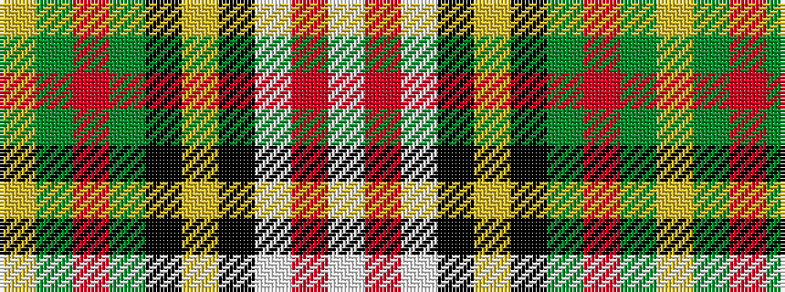

WRWKYKGRGY

It is a 10 stripe tartan.

<figure class="pat-woven">

<figcaption>idealised sample</figcaption>
</figure>

## Colour Sequence



## Tartans with this colour sequence

| Tartans |
|---------------|
| [Spanish shirt](/setts/s10/w7r1w14k6lo2k6g14r2g10lo1~x2/)|
||
