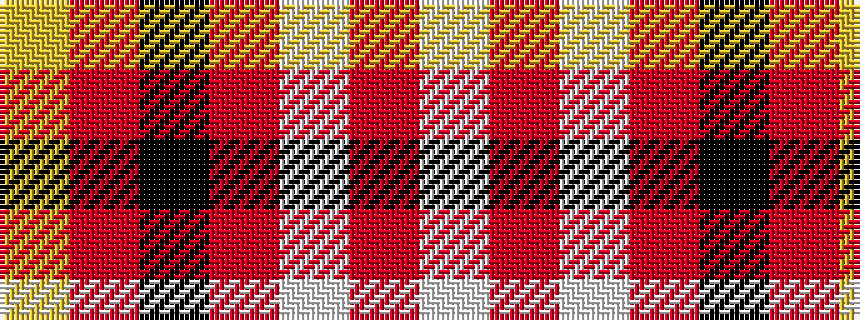

WRWRKRY

It is a 7 stripe tartan.

<figure class="pat-woven">

<figcaption>idealised sample</figcaption>
</figure>

## Colour Sequence



## Tartans with this colour sequence

| Tartans |
|---------------|
| [Cunningham Dress Burgundy (Dance)](/variants/s7/w5r2w34r34k2r2ly4~x2/)|
||
