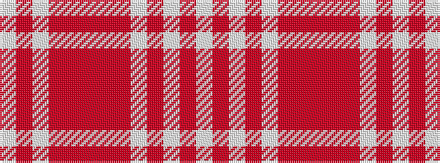

WRWRRRRRWRWRW

It is a 13 stripe tartan.

<figure class="pat-woven">

<figcaption>idealised sample</figcaption>
</figure>

## Colour Sequence



## Tartans with this colour sequence

| Tartans |
|---------------|
| [MacLachlan, Marled Dress (Fashion)](/setts/s13/lb16o2lb2o2lb2o16o16r3o16o16lb16o2lb2~x2/)|
||
