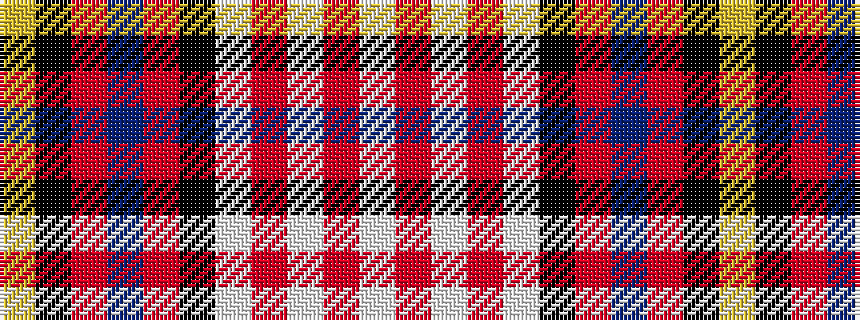

WRWRWKRBRKY

It is a 11 stripe tartan.

<figure class="pat-woven">

<figcaption>idealised sample</figcaption>
</figure>

## Colour Sequence



## Tartans with this colour sequence

| Tartans |
|---------------|
| [Cameron of Erracht Dress](/variants/s11/w2r1w2r2w9k9r1db10r2k2ly2~x2/)|
||
