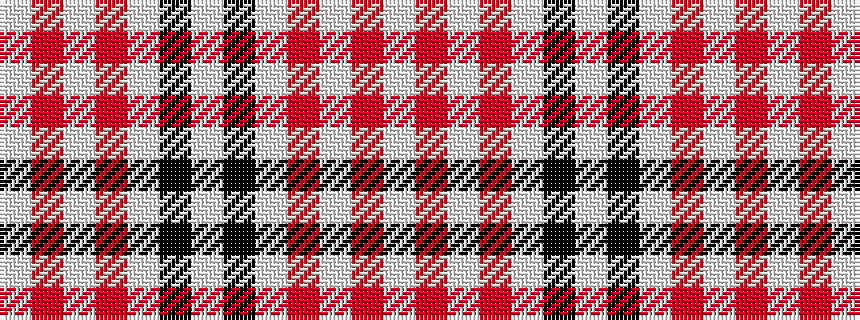

WRWRWKWKWRWRW

It is a 13 stripe tartan.

<figure class="pat-woven">

<figcaption>idealised sample</figcaption>
</figure>

## Colour Sequence



## Tartans with this colour sequence

| Tartans |
|---------------|
| [Virginia Quadricentennial](/setts/s13/w40o3w10o6w20k3w2k3w10r4w2r8w2/)|
||
