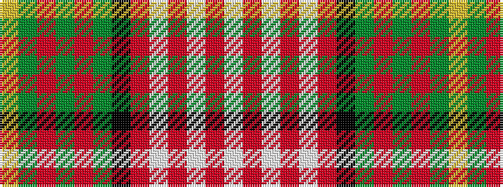

WRWRWRKGRGRGY

It is a 13 stripe tartan.

<figure class="pat-woven">

<figcaption>idealised sample</figcaption>
</figure>

## Colour Sequence



## Tartans with this colour sequence

| Tartans |
|---------------|
| [Carnegie Dress](/variants/s13/w8r2w2r6w13r2k13dg13r6dg2r2dg4ly3~x2/)|
||
| [Carnegie Dress #1 (Fashion)](/variants/s13/w8r2w2r6w13r2k13g13r6g2r2g4ly3~x2/)|
||
| [Carnegie Dress #2 (Fashion)](/variants/s13/w18r3w3r10w26r3k26g28r10g3r3g8lo6/)|
||
| [Valley of the Green #2](/variants/s13/w9r2w2r6w14r2k14g14r6g2r2g8ly3~x2/)|
||
