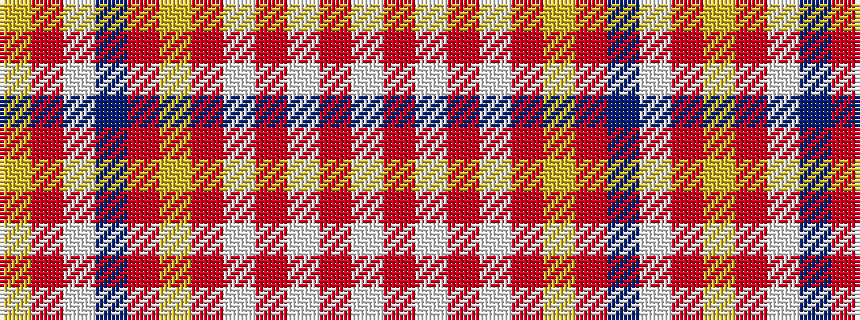

WRWRWRYRBWRY

It is a 12 stripe tartan.

<figure class="pat-woven">

<figcaption>idealised sample</figcaption>
</figure>

## Colour Sequence



## Tartans with this colour sequence

| Tartans |
|---------------|
| [Spirit of Dunkeld](/setts/s12/lt38r1lt2r2lt2r6ly4r10db8lt11r3ly1~x2/)|
||
