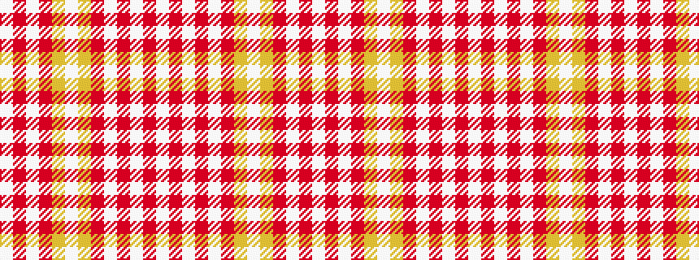

WRWRWRYWYRWRW

It is a 13 stripe tartan.

<figure class="pat-woven">

<figcaption>idealised sample</figcaption>
</figure>

## Colour Sequence



## Tartans with this colour sequence

| Tartans |
|---------------|
| [Poulter SG 097 (Fashion)](/variants/s13/w25r8w8r8w8r46lr46w8lr46r46w46r8w8/)|
||
