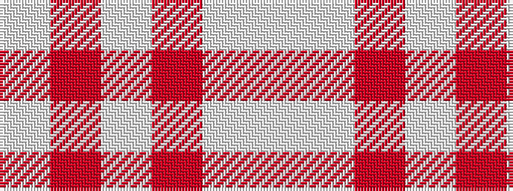

WRWRWW

It is a 6 stripe tartan.

<figure class="pat-woven">

<figcaption>idealised sample</figcaption>
</figure>

## Colour Sequence



## Tartans with this colour sequence

| Tartans |
|---------------|
| [Masai Shuka 13 (Artefact)](/setts/s6/lb25w5r1w1r1w20~x4/)|
||
