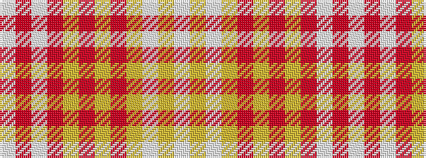

WRWRYRYRYWYW

It is a 12 stripe tartan.

<figure class="pat-woven">

<figcaption>idealised sample</figcaption>
</figure>

## Colour Sequence



## Tartans with this colour sequence

| Tartans |
|---------------|
| [Bob the Builder (Corporate?)](/variants/s12/w1r3w1r28ly1r3ly3r1ly28w1ly3w1~x2/)|
||
