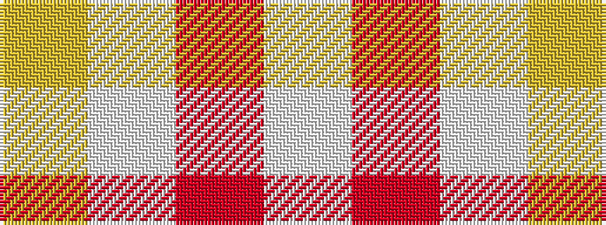

WRWY

It is a 4 stripe tartan.

<figure class="pat-woven">

<figcaption>idealised sample</figcaption>
</figure>

## Colour Sequence



## Tartans with this colour sequence

| Tartans |
|---------------|
| [Lewis, Magenta (Dance)](/setts/s4/w4m31w35lg4~x2/)|
||
