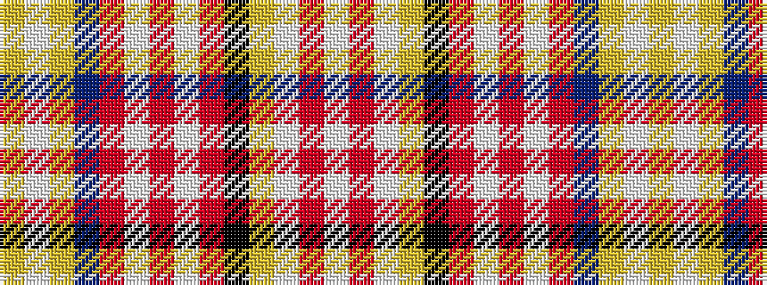

WRWYKRWRWRBYWY

It is a 14 stripe tartan.

<figure class="pat-woven">

<figcaption>idealised sample</figcaption>
</figure>

## Colour Sequence



## Tartans with this colour sequence

| Tartans |
|---------------|
| [Ogilvy](/setts/s14/lb10r3lb10ly5k2r6lb2r6lb2r6db2ly2lb5lr2/)|
||
