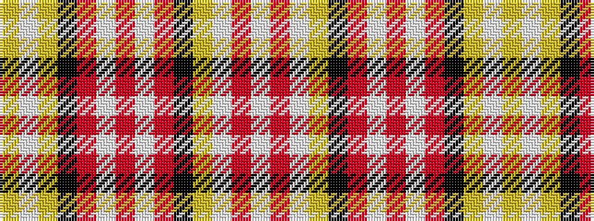

WRWYKRWRWRKYWY

It is a 14 stripe tartan.

<figure class="pat-woven">

<figcaption>idealised sample</figcaption>
</figure>

## Colour Sequence



## Tartans with this colour sequence

| Tartans |
|---------------|
| [Ogilvy D](/setts/s14/lb4r1lb4ly1k1r6lb1r4lb1r6k1ly1lb4lr1~x2/)|
||
