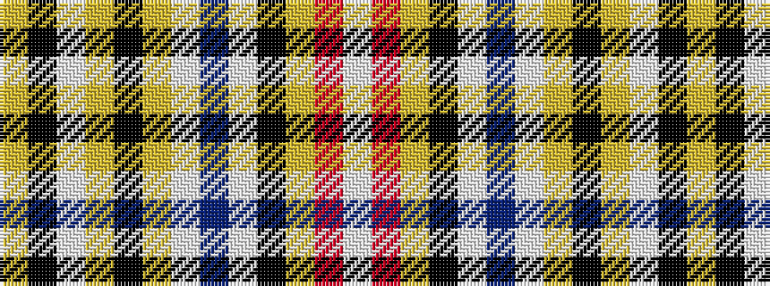

WRYKWBWYKYWKY

It is a 13 stripe tartan.

<figure class="pat-woven">

<figcaption>idealised sample</figcaption>
</figure>

## Colour Sequence



## Tartans with this colour sequence

| Tartans |
|---------------|
| [Euphoria (Universal)](/setts/s13/w1r1lr8k1w1b8w1lr8k1lr1w8k1lr1~x6/)|
||
