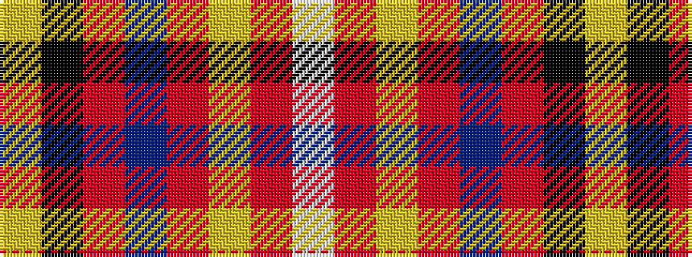

WRYRBRKY

It is a 8 stripe tartan.

<figure class="pat-woven">

<figcaption>idealised sample</figcaption>
</figure>

## Colour Sequence



## Tartans with this colour sequence

| Tartans |
|---------------|
| [Westin Kierland (Corporate)](/setts/s8/lo2k38r10db3r5ly4r3lb2~x2/)|
||
