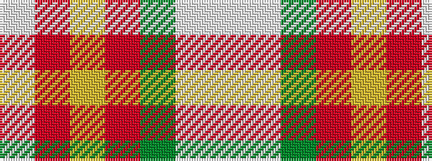

WRYRGWW

It is a 7 stripe tartan.

<figure class="pat-woven">

<figcaption>idealised sample</figcaption>
</figure>

## Colour Sequence



## Tartans with this colour sequence

| Tartans |
|---------------|
| [Lake Ainslie Heritage](/variants/s7/lb8w16g18r2ly4r1lb4~x2/)|
||
