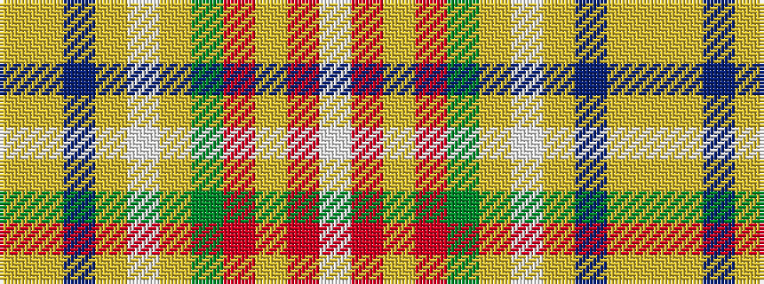

WRYRGYWYBYY

It is a 11 stripe tartan.

<figure class="pat-woven">

<figcaption>idealised sample</figcaption>
</figure>

## Colour Sequence



## Tartans with this colour sequence

| Tartans |
|---------------|
| [Muirhead (Original)](/setts/s11/ly6lo48db8lo16w4lo3g19r24lo4r9w4/)|
||
